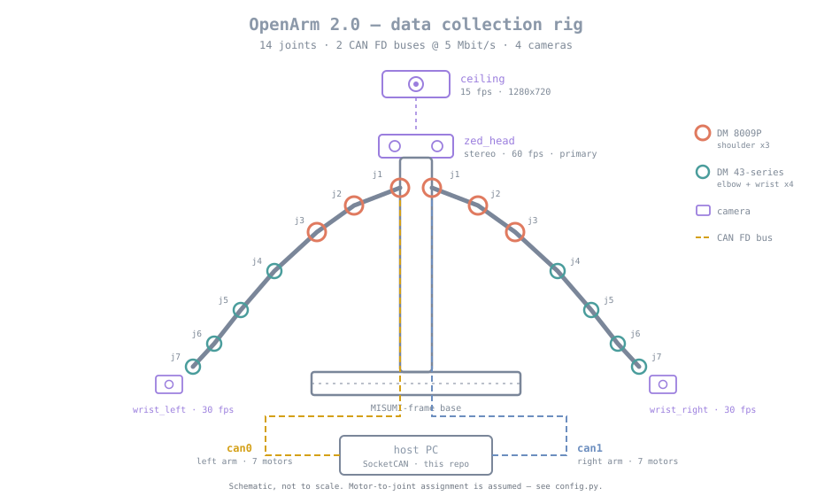

<div align="center">

# OpenArm 2.0-Data Collection Pipeline

**A teleoperation recording platform for the [OpenArm 2.0](https://docs.openarm.dev) bimanual robot arm.**
Reads joint state over CAN FD, synchronises it with four camera streams, stores episodes for
robot learning, and serves them over a REST API with a live dashboard.



</div>

---

## Status

| | Task | State | Notes |
|:--:|---|:--|---|
| 1 | **CAN interface setup** | 📝 **Documented, not run** | No hardware. Full reasoning below |
| 2 | **CAN data reading** | ✅ **Working** | 995.8 Hz sustained against a simulated arm |
| 3 | Multi-camera synchronisation | ⬜ Not started | |
| 4 | Storage backend + REST API | ⬜ Not started | |
| 5 | Monitoring dashboard | ⬜ Not started | |

> ### ⚠️ Read this first
>
> **I had no OpenArm, no CAN adapter, and no cameras.** Every data source in this project has
> two implementations behind one interface: a **simulated** one that runs anywhere, and a
> **hardware** one written against the SocketCAN and python-can documentation but **never
> executed**.
>
> Simulated data is labelled as such in episode metadata, in filenames, and on screen. Nothing
> here should ever be mistaken for a real demonstration.

---

## Quick start

```bash
python3 -m venv .venv
./.venv/bin/pip install -r requirements.txt

./.venv/bin/python -m pytest tests/ -q          # 13 tests
./.venv/bin/python scripts/read_joints.py       # live joint state, simulated arm
```

---

## Task 1 — CAN FD interface setup

> *"Follow the setup guide to configure the CAN FD interfaces. Run `openarm-can-cli
> can_configure` and set the zero position on both can0 and can1. Show a screenshot or terminal
> output confirming the interfaces are UP and zero position is set."*

**Status: not performed.** Bringing up a CAN interface needs a physical adapter, and zeroing
writes a value into physical motors. I had neither, and I was on macOS, which has no SocketCAN
at all. The only thing I could have submitted was a fabricated screenshot.

What follows is the procedure I would run and why. Everything marked **[UNVERIFIED]** is
reasoning from documentation rather than something I observed.

### Why the rig needs two buses

The single most useful thing I worked out while reading the spec. The task hands you `can0` and
`can1` without saying why, and the reason falls out of arithmetic.

Each motor exchanges **two messages per control cycle** — a command from the host and a reply
from the motor — and both travel on the same shared pair of wires. At the 1 kHz control loop
OpenArm 2.0 runs:

```
  7 motors  ×  2 messages  ×  1000 Hz          =  14,000 messages/sec  per arm
  14,000 msg/sec  ×  ~50 µs per CAN FD frame   ≈  0.70 s of wire time per second
                                               ≈  70 % bus load
```

70 % is already past the point where arbitration delay makes worst-case latency unpredictable;
the usual design guidance is to stay under 50–60 %. **Both arms on one bus would need ~140 %,
which is not physically possible.** Split one arm per bus and each sits near **35 %**, with
headroom for retransmission.

> **[UNVERIFIED]** — this is my own estimate, not a figure from the OpenArm docs, and the frame
> timing is approximate. If the rig uses a single broadcast sync frame instead of per-motor
> commands, the count drops substantially. The conclusion holds either way: one bus cannot carry
> both arms.

### Bringing the interfaces up

SocketCAN presents a CAN adapter as an ordinary Linux network interface, so it is configured
with `ip link` — the same tool used for ethernet.

```bash
# docs.openarm.dev/software/setup/can-setup/
sudo ip link set can0 down                                               # must be down to change parameters
sudo ip link set can0 type can bitrate 1000000 dbitrate 5000000 fd on    # 1 Mbit arbitration, 5 Mbit data, FD on
sudo ip link set can0 up

openarm-can-cli -i can0 can_configure                                    # then the zero-position tare
```

Then identically for `can1`. Note `-i` precedes the subcommand.

On top of the documented command I would add `sample-point 0.75`, `dsample-point 0.75` and
`txqueuelen 1000`. **Those three are mine, not OpenArm's** — reasoning in the fold below.

<details>
<summary><b>Why each flag is there, and two deliberate omissions</b></summary>

<br>

| Flag | Reason |
|---|---|
| `bitrate 1000000` | Arbitration phase. Every node must agree on it, and it is where bus arbitration happens, so it stays slow and robust. |
| `dbitrate 5000000` | Data phase. CAN FD's core trick: once a node has won arbitration nobody is competing, so the payload can clock much faster. |
| `fd on` | Enables CAN FD. Without it the controller stays in classic mode — 8-byte payloads, no data-phase switch. |
| `sample-point 0.75` | **Mine, not in the OpenArm guide.** Where in each bit the controller samples. The CiA-recommended value at these rates; trades noise margin against tolerance for clock mismatch between nodes. |
| `txqueuelen 1000` | **Mine, not in the OpenArm guide.** Kernel transmit buffer. The default of 10 is sized for a low-rate bus and will drop outbound frames at 1 kHz across 7 motors. |

**No `restart-ms`.** Automatic bus-off recovery sounds helpful and is wrong for a data recorder.
A bus-off event means the recording is already compromised, and silently recovering hides that
from the operator. Fail visibly instead.

**Not done from Python.** Reconfiguring an interface needs `CAP_NET_ADMIN`, and a recording
process should not run privileged. `socketcan.py::setup_commands()` returns these commands as
strings rather than executing them.

</details>

### What the screenshot would show

```console
$ ip -details -statistics link show can0

2: can0: <NOARP,UP,LOWER_UP,ECHO> mtu 72 qdisc pfifo_fast state UP
    can <FD> state ERROR-ACTIVE restart-ms 0
      bitrate 1000000 sample-point 0.750
      dbitrate 5000000 dsample-point 0.750
      re-started bus-errors arbit-lost error-warn error-pass bus-off
      0          0          0          0          0          0
```

Four things I would actually check, in order:

1. **`state UP`** — the interface is running.
2. **`mtu 72`** — 64 data bytes + 8 header, so FD is active. **`mtu 16` means FD did not take**
   and the bus is in classic mode, which will not carry full Damiao frames.
3. **`ERROR-ACTIVE`** — the healthy state. `ERROR-PASSIVE` or `BUS-OFF` points at wiring:
   termination, grounding, or a bitrate mismatch.
4. **Error counters at zero.** Non-zero and climbing on an idle bus is a physical-layer fault,
   not a software one.

### Zero position

The Damiao motors are **quasi-direct-drive**, so the arm is backdrivable and gets moved by hand.
Each encoder reports an angle against an internal reference with no relationship to the arm's
geometry. Zeroing declares the **current physical pose** to be 0 rad on every joint.

It is the same operation as taring a scale, and it matters for the same reason: without it,
"joint 4 at 0.5 rad" means something different every session, and a policy trained on Monday's
data is handed a different coordinate frame on Tuesday.

The arm is not posed by hand for this. It goes into a **purpose-built calibration jig** — press
the arm pipe into the jig recess, seat the trigger flat against the jig face, clamp the body,
fasten with two 12 mm M2 screws, then mirror on the other side. That is the point of the jig:
the reference pose is repeatable to a machined surface rather than to someone's judgement.
OpenArm budgets roughly 45 minutes for calibration and homing.

Underneath the CLI, zeroing is one reserved 8-byte payload sent to each motor ID:

```
FF FF FF FF FF FF FF FE     set zero position
FF FF FF FF FF FF FF FC     enable
FF FF FF FF FF FF FF FD     disable
FF FF FF FF FF FF FF FB     clear error
```

These are implemented in [`can/protocol.py`](openarm_pipeline/can/protocol.py) as `CMD_SET_ZERO`
and friends, and [`tests/test_protocol.py`](tests/test_protocol.py) asserts the byte sequence.

<details>
<summary><b>Physical procedure, and what I expect to go wrong</b></summary>

<br>

Before running it: power the motors but leave them **disabled** so the arm moves freely; move
both arms into the documented home pose against their mechanical hard stops (OpenArm 2.0 has
stops on every axis, which is what makes the pose repeatable rather than eyeballed); **support
the arms**, because a QDD arm has almost no gearbox friction and will fall under its own weight
the instant it is released; then zero, enable, and confirm every joint reads ~0.

Ranked by how likely I think they are:

| Failure | Symptom | Cause |
|---|---|---|
| Bitrate mismatch | `ERROR-PASSIVE`, counters climbing, no valid frames | Motors configured for a different data-phase rate |
| FD not enabled | `mtu 16`, frames truncated or rejected | `fd on` omitted, or adapter lacks FD support |
| Missing termination | Intermittent CRC errors, worse under load | No 120 Ω, or three terminators instead of two |
| ID collision | Two joints reporting identical values | Two motors flashed with the same CAN ID |
| **Wrong scaling constants** | **Plausible but physically wrong angles** | **See below — the one that worries me** |

</details>

### 🔴 The part of my own work I cannot vouch for

Damiao motors do not transmit floating-point numbers. They transmit integers, and both ends must
agree on what physical range those integers span. Those limits live in
[`config.py`](openarm_pipeline/config.py) as `MOTOR_SPECS`, and they follow the **public MIT-mode
convention** — I could not check them against a Damiao datasheet.

**If they are wrong, nothing breaks.** The decoder returns smooth, believable numbers in the
wrong units, with no error and no warning. It is the only failure mode on the list that is
completely silent, which is exactly why it is the one I would chase first.

**First test with hardware:** move one joint to a physically measured angle and check the decoder
agrees. Ten minutes, and it either validates the whole read path or invalidates it.

### What I built instead

- The **real Damiao frame format**, tested by round trip — proving my parser self-consistent,
  though not that it matches a real motor
- A `CANSource` interface between the bus and everything downstream, with `MockCANSource` and
  `SocketCANSource` behind it, so hardware bring-up is a one-line change
- [`SocketCANSource`](openarm_pipeline/can/socketcan.py) written in full against the SocketCAN and
  python-can docs, clearly marked untested, with the places I expect to be wrong called out in
  comments

**Sources:** [CAN setup guide](https://docs.openarm.dev/software/setup/can-setup/) ·
[calibration workflow](https://docs.openarm.dev/hardware/openarm-ker/calibration-workflow) ·
[enactic/openarm_can](https://github.com/enactic/openarm_can)

📄 **Full detail:** [`docs/01-can-setup.md`](docs/01-can-setup.md) — physical layer, termination and
grounding, every flag, the complete failure table, and references.

---

## Task 2 - CAN data reading

> *"Read live joint position, velocity, and torque from the arm over CAN FD. If you don't have
> hardware access, mock the CAN data stream in software and note that clearly."*

✅ **Working.** All 14 joints, decoded from genuine Damiao MIT-mode frames produced by a
simulated arm, sustained at **995.8 Hz** against the 1 kHz target.

### The decision that shapes everything: where to fake

With no arm, you are writing a simulation. The question is *at which layer*, and it is the only
choice here that is hard to reverse.

```
  OPTION A  (rejected)                 OPTION B  (chosen)

  fake ──▶ position = 0.34             fake ──▶ 0x04 0x90 0x15 0x88 ...
           velocity = 1.20                            │
           torque   = 2.44                            ▼
                                              REAL decoder runs
                                                      │
                                                      ▼
                                              position = 0.34
```

**Option A produces a demo that proves nothing.** The decoder, which is the actual hard part,
never executes. You would have tested your imagination.

**Option B means every frame in the simulation is real Damiao format, parsed by the real
parser.** The bit-unpacking, the scaling, the error handling and the frame assembler are all
exercised on every run. Attach hardware and none of that code path changes.

The cost is that the mock has to know the wire format, which is more work. Worth it: it is the
difference between a stub and a test fixture the pipeline can be regression-tested against
permanently, since CI cannot plug in a robot arm.

### What is actually in a frame

Eight bytes carry position, velocity, torque, two temperatures, the motor ID and an error code,
a thousand times a second. There is no room for anything readable.

```
 byte   0      1      2      3      4      5      6      7
      ┌─────┬─────────────┬─────┬─────┬─────┬─────┬─────┐
      │ ID  │  POSITION   │ VEL │ V|T │ TRQ │Tmos │Trot │
      │+err │   16 bit    │     │     │     │     │     │
      └─────┴─────────────┴─────┴─────┴─────┴─────┴─────┘
                                  ▲
                     byte 4 is SHARED: high nibble finishes
                     velocity, low nibble starts torque
```

That shared byte is where a hand-written parser goes wrong, so
[`tests/test_protocol.py`](tests/test_protocol.py) attacks it directly: drive velocity to its
maximum while holding torque at its minimum, then reverse the pairing. A swapped nibble cannot
pass both.

### The values are integers, and that has consequences

A motor does not transmit `0.34 radians`. It transmits an integer, and both ends must already
agree what range it spans. Two consequences:

**Resolution differs per field.** Position gets 16 bits, velocity and torque only 12:

```console
sent:     pos 1.5708 rad    vel 2.0 rad/s     torque 1.25 Nm
decoded:  pos 1.5707 rad    vel 2.0000 rad/s  torque 1.2479 Nm
          └─ 16 bit, ~0.0004 rad ─┘           └─ 12 bit, ~0.005 Nm ─┘
```

Torque resolves to roughly 4,000 steps across its full range, not 65,000. Worth knowing before
trusting a torque figure to three decimals.

**And the scaling constants are the silent failure mode** described in Task 1: wrong limits give
smooth, believable, incorrect values with no error at all.

### There is no such thing as "the arm right now"

The most interesting thing I learned building this. Downstream code wants a snapshot: 14
positions at one instant. **The bus cannot provide that.** Each motor answers separately,
microseconds apart, so a snapshot is a *reconstruction*, and every reconstruction makes choices.

| Question | Options | Chosen | Why |
|---|---|---|---|
| A joint missed this cycle | stall / carry forward | **carry forward, mark `valid=False`** | one dead motor should degrade a recording, not end it |
| Readings span real time | present as instantaneous / measure it | **measure it, publish `spread_s`** | the dataset should carry evidence of its own precision |
| Which timestamp to use | average them / newest reading | **newest** | an average is a number no sensor ever produced |

That last row is a small decision with a large principle behind it: **when you cannot have the
true value, report a real one plus its error, never a synthetic one that hides it.**

Measured spread is **0.32 ms**. For scale, a joint moving at 2 rad/s travels 0.00064 rad in that
window, which is about 1.7 least-significant bits of position resolution. Comparable to
quantisation noise, so interpolating within a snapshot would be false precision.

<details>
<summary><b>Why interpolate at all, and where it stops being valid</b></summary>

<br>

The same question returns much larger in Task 3, where camera frames sit tens of milliseconds
apart rather than fractions of one. The answer splits by signal type:

| | Interpolate? | Reason |
|---|:--:|---|
| Joint position | ✅ | Continuous physical signal. A joint cannot teleport. Better still, the motor reports velocity too, so cubic Hermite interpolation is available for free and beats linear |
| Joint torque | ⚠️ | Not smooth. Contact events are near discontinuous, and interpolating across one invents a gentle ramp where reality had a step |
| Camera frames | ❌ | Blending two images produces a ghost of something that never existed. Training a vision policy on manufactured frames teaches it artifacts the real camera never produces |

Scale of the problem, joint at 2 rad/s:

```
  snapshot spread   0.32 ms  ->  0.037 deg of arm movement   negligible
  ceiling camera    66.7 ms  ->  7.6 deg of arm movement     enormous
```

Which drives the Task 3 architecture: **do not resample at record time.** At record time you do
not yet know what the training code will want, and discarding raw samples makes that choice
permanent. Store native rates with honest timestamps; align at read time under a declared
policy; mark anything interpolated as interpolated.

</details>

### Proving it works with no arm to compare against

What cannot be proven without hardware: that the decoder matches a real Damiao motor. That
requires moving a joint to a measured angle and checking agreement.

What can be proven, and is: the decoder is self-consistent, handles the split byte correctly,
saturates instead of wrapping on overflow, and rejects malformed frames rather than guessing.
**13 tests, named so the intent reads without opening them.**

```console
$ python -m pytest tests/ -q
.............                                                    [100%]
13 passed in 0.01s
```

### Results

```console
$ python scripts/read_joints.py --duration 3

  ** SIMULATED DATA - NOT A REAL ARM **

  joint                    pos (rad)   vel (rad/s)   torque (Nm)
  --------------------------------------------------------------------
  left_j1_shoulder_pitch     -0.1940        0.0110        2.4396    ok
  left_j2_shoulder_roll      -0.3256       -0.1429        2.2813    ok
  ...
  right_j7_wrist_yaw         -0.0158       -1.5458       -0.1099    ok
  --------------------------------------------------------------------
  frames     41807   dropped    26   bad   0   unknown   0
  snapshot spread  0.32 ms   (time between oldest and newest reading)
```

| Measured over 3 s | |
|---|---|
| Sustained rate | **995.8 Hz** against a 1 kHz target |
| Frames decoded | 41,807, with **0 bad and 0 unknown** |
| Frames dropped | 26 (0.06%), injected deliberately |
| Snapshot spread | 0.32 ms |

<details>
<summary><b>What the simulated arm does and does not model</b></summary>

<br>

**Faithful:**

- Frames are real Damiao MIT-mode bytes, produced by `encode_feedback` and parsed by the same
  decoder the hardware path uses
- Motors are polled round robin, one frame each, as on a real bus. A snapshot is never atomic
- 0.1% of frames are dropped and timing jitter is injected, so the `valid` mask and the spread
  measurement are actually exercised rather than sitting untested
- Seeded, so runs are reproducible

**Not faithful:**

- Motion is two sine waves per joint, chosen because it is smooth and analytically
  differentiable, so velocity is exact rather than estimated. It is not a real teleoperation
  demonstration
- Torque is a gravity plus inertia stand-in, not this arm's dynamics
- No bus arbitration, electrical faults, or controller latency

Every episode recorded from this source is tagged `is_mock=True` in metadata and in its
filename, and the reader prints a banner. Synthetic data must never be mistakable for a real
demonstration six months later.

</details>

---

## Tasks 3–5

Not yet started. Sections to follow.

---

## Repository layout

```
openarm_pipeline/
  config.py        rig description: 14 joints, 4 cameras, bus rates
  clock.py         the single timestamp policy every subsystem uses
  can/
    protocol.py    Damiao MIT-mode frame encode/decode
    source.py      the mock-vs-hardware seam
    mock.py        simulated arm
    socketcan.py   real hardware path (untested)
    assembler.py   individual motor frames -> whole-arm snapshots
scripts/
  read_joints.py   Task 2 live reader
docs/
  01-can-setup.md  Task 1, in full
tests/
```

## Licence

MIT
